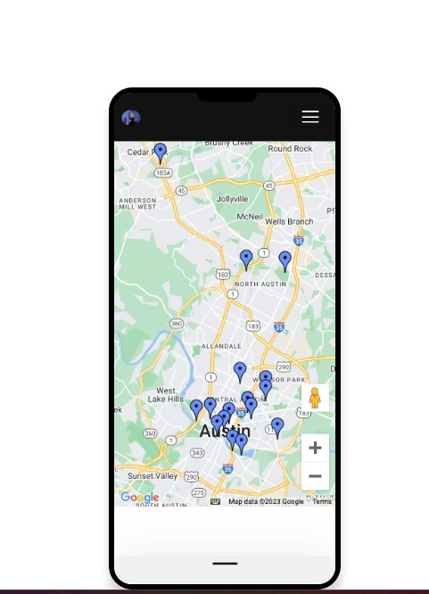
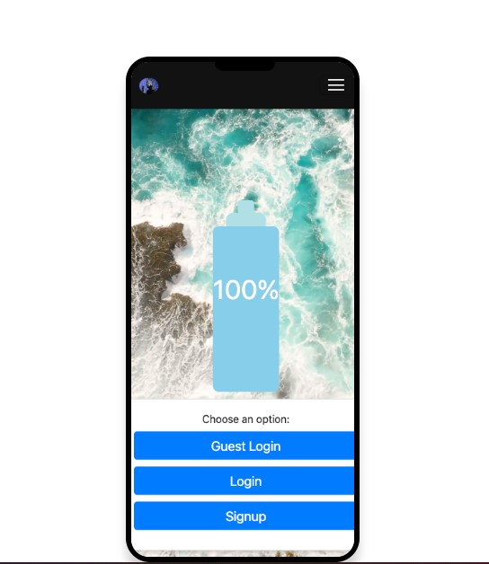
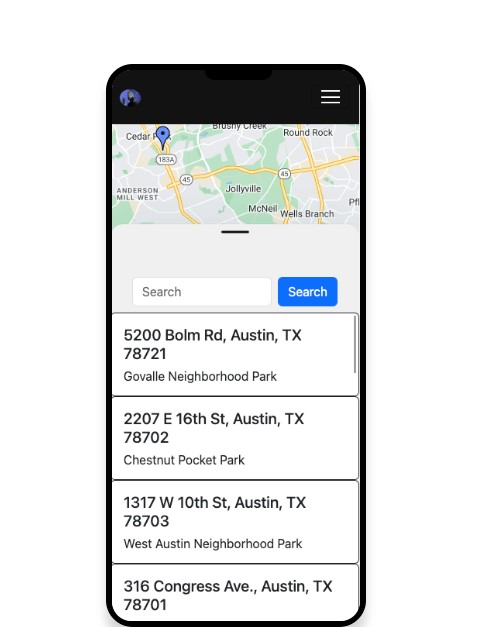

# W.E.T. (Water Environment Tracker)
  
        

  ## Description
  W.E.T. (Water Environment Tracker) is a mobile first application that is meant to help users save money, time, and the environment all in one place. We want our users to be able to quickly and easily refill their water bottles wherever they are. If they are hiking in a national park or going on a run in their neighborhood W.E.T. is there to quench their thirst.

  ## Table of Contents
  - [Examples](#examples)

  - [Installation](#installation)

  - [Credits](#credits)

  - [License](#license)

  - [Questions](#questions)

  ## Examples
  
  
  

  ## Installation
  1. Navigate to:
  2. Click on the blue "code" button and copy the SSH URL
  3. Open your terminal and type `git clone` and hit enter
  4. Then type `code .` and hit enter
  5. Navigate to the root package.json file
  6. Right click and open in your integrated terminal
  7. Follow the scripts in the package.json to run the app

  
  ## License
  This application is protected under the [MIT](https://opensource.org/license/mit) license. Click the link to learn more.

  ## Questions
  For additional questions you can contact W.E.T. at any of our GItHubs:

  GitHub:

  [Pablo Archuleta](https://github.com/xJuanPablo)

  [Daniel Lee](https://github.com/drog41813)

  [Micaella Villanueva](https://github.com/micavilla)

  [Lucas Wysoczanski](https://github.com/LucasWyski001)

  [ColtonSiegmund](https://github.com/ColtonSiegmund)

  ## Credits
   [Pablo Archuleta](https://github.com/xJuanPablo)

  [Daniel Lee](https://github.com/drog41813)

  [Micaella Villanueva](https://github.com/micavilla)

  [Lucas Wysoczanski](https://github.com/LucasWyski001)

  [ColtonSiegmund](https://github.com/ColtonSiegmund)

